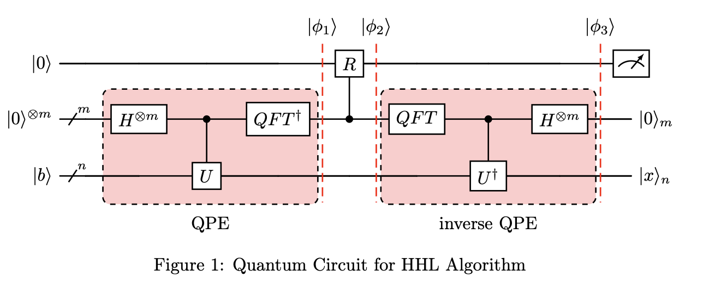

# HHL Algorithm — CS308 Final Project 🧮⚛️

Solve linear systems with the HHL (Harrow–Hassidim–Lloyd) quantum algorithm using Qiskit. This repository contains a complete, step-by-step Jupyter notebook that builds the HHL circuit from scratch: Quantum Phase Estimation (QPE), a controlled rotation, inverse QPE, and measurement, with validation and simulation on statevector backends.

- Core notebook: [com-308-project_empty.ipynb](./com-308-project_empty.ipynb)
- Circuit diagrams: included below and available as images

## What’s inside 📦

- A clean, minimal implementation using modern Qiskit primitives (statevector resources).
- Explicit construction of controlled-U gates by exponentiating a Hermitian A with SciPy and wrapping as Qiskit unitaries.
- A recursive, gate-level QFT and inverse QFT that matches QPE requirements.
- A controlled $R_y$ rotation schedule matched to eigenvalues that are powers of two for a simple, exact path.
- Validation blocks that prove cU followed by its inverse is identity, QFT correctness on basis states, and correctness of the reconstructed solution $|x\rangle$.
- Probability-of-success estimation for the ancilla measurement and histogram sampling.

## Visual overview 🖼️

- Full HHL circuit



- Detailed QPE block


## Techniques and algorithmic highlights 🔍

- Quantum Phase Estimation (QPE), inverse QPE, and eigenvalue encoding:
  
  $$U = e^{i\, 2\pi \frac{A}{2^m}}$$
  
  $$QFT^{\dagger} \ , |k\rangle = \frac{1}{\sqrt{2^m}} \sum_{j=0}^{2^m-1} e^{-i \ , 2\pi \frac{k j}{2^m}} \ , |j\rangle$$
  
  - QFT implementation with controlled phase rotations (Qiskit: [QuantumCircuit.cp](https://docs.quantum.ibm.com/api/qiskit/qiskit.circuit.QuantumCircuit#cp))
  - Inverse via circuit inversion and reverse application

- Gate-level QFT on $m$ qubits (recursive):
  - Uses controlled phase angles $\pi/2^{(k)}$ and register swaps
  - Related reference: Qiskit’s Fourier transforms (docs: [QFT circuit](https://docs.quantum.ibm.com/api/qiskit/qiskit.circuit.library.QFT))

- Constructing controlled- $U^{2^i}$ from a Hermitian $A$:
  
  $$U = e^{i\, 2\pi \frac{A}{2^m}}, \qquad U^{2^i} = e^{i\, 2\pi \frac{A \cdot 2^i}{2^m}}$$
  
  - Matrix exponential via SciPy: [scipy.linalg.expm](https://docs.scipy.org/doc/scipy/reference/generated/scipy.linalg.expm.html)
  - Wrapped as Qiskit unitaries: [UnitaryGate](https://docs.quantum.ibm.com/api/qiskit/qiskit.circuit.library.UnitaryGate)

- Controlled $R_y(\theta)$ rotations for the $1/\lambda$ factor:
  
  $$R\big(|0\rangle \otimes |\lambda\rangle\big) = \Big(\sqrt{1 - \tfrac{1}{\lambda^2}}\,|0\rangle + \tfrac{1}{\lambda}\,|1\rangle\Big) \otimes |\lambda\rangle$$
  
  - Qiskit: [QuantumCircuit.cry](https://docs.quantum.ibm.com/api/qiskit/qiskit.circuit.QuantumCircuit#cry)

- Simulation and sampling:
  - Modern primitives: [StatevectorSampler](https://docs.quantum.ibm.com/api/qiskit/qiskit.primitives.StatevectorSampler)
  - Visualization: [plot_histogram](https://docs.quantum.ibm.com/api/qiskit/qiskit.visualization.plot_histogram)

- Statevector math and validation:
  - Operator checks via [qiskit.quantum_info.Operator](https://docs.quantum.ibm.com/api/qiskit/qiskit.quantum_info.Operator)
  - Numerical checks with NumPy: [numpy.linalg](https://numpy.org/doc/stable/reference/routines.linalg.html)

- Qubit endianness and register layout awareness:
  - Qiskit’s bit order is little-endian; the notebook calls this out when mapping memory/ancilla/output registers. See Qiskit’s note on [classical/quantum bit ordering](https://docs.quantum.ibm.com/guides/circuit-tracing-and-dag#endianness).

Where MDN fits (if you’re coming from the web world): this project doesn’t use browser APIs. When we mention transforms or measurement “observables,” think math/linear algebra, not CSS transforms or the [Web Animations API](https://developer.mozilla.org/docs/Web/API/Web_Animations_API). For web developers, the closest analogy is building a pipeline by composing small, testable primitives.

## Non‑obvious libraries and components worth noting 🧠

- Qiskit Primitives (statevector-only execution, no hardware backend required):
  - [StatevectorSampler](https://docs.quantum.ibm.com/api/qiskit/qiskit.primitives.StatevectorSampler)
  - [StatevectorEstimator](https://docs.quantum.ibm.com/api/qiskit/qiskit.primitives.StatevectorEstimator)
- Qiskit circuit building blocks:
  - [QuantumCircuit](https://docs.quantum.ibm.com/api/qiskit/qiskit.circuit.QuantumCircuit), [UnitaryGate](https://docs.quantum.ibm.com/api/qiskit/qiskit.circuit.library.UnitaryGate), [SparsePauliOp](https://docs.quantum.ibm.com/api/qiskit/qiskit.quantum_info.SparsePauliOp)
- Hermitian sampling and exponentiation:
  - NumPy eigen-decomposition: [numpy.linalg.eigh](https://numpy.org/doc/stable/reference/generated/numpy.linalg.eigh.html)
  - SciPy matrix exponential: [expm](https://docs.scipy.org/doc/scipy/reference/generated/scipy.linalg.expm.html)
- Visualization:
  - Matplotlib: [matplotlib.org](https://matplotlib.org/)
  - Qiskit plotting utilities: [plot_histogram](https://docs.quantum.ibm.com/api/qiskit/qiskit.visualization.plot_histogram)
- LaTeX-based state display (optional):
  - [pylatexenc](https://pylatexenc.readthedocs.io/)
  - When LaTeX rendering is enabled, the default font is often [Computer Modern](https://ctan.org/pkg/computermodern), though this depends on your local TeX installation.
- IBM Quantum platform (legacy link referenced): [quantum.ibm.com](https://quantum.ibm.com)

## Development highlights 🛠️

- [com-308-project_empty.ipynb](./com-308-project_empty.ipynb) builds the HHL stack in stages:
  - Hadamard layer $H^{\otimes m}$
  - Controlled- $U^{2^i}$ and its inverse from $e^{i \ , 2\pi A / 2^m}$
  - $QFT$ and $QFT^{\dagger}$ (gate-level, not using the library QFT except for comparison)
  - Controlled $R_y$ schedule tuned for $\lambda = 2^i$
  - Assembly into HHL, with correctness checks for identity, QFT mapping, and $|x\rangle$ extraction
  - Sampler-based probability estimates and histogram plots
  - Notes on bit order, register layout, and how to slice amplitudes to extract $|x\rangle$
- Circuit visuals: [circuit.png](./circuit.png), [qpe.png](./qpe.png)
- Project write-ups: [HHL_project.pdf](./HHL_project.pdf), [Projet IQC.pdf](./Projet%20IQC.pdf)

## Project structure 🗂️

```text
/
├─ circuit.png
├─ qpe.png
├─ com-308-project_empty.ipynb
├─ HHL_project.pdf
├─ Projet IQC.pdf
└─ README.md
```

Notes:
- Images currently live at the repository root for convenience. If you prefer, move them into an images/ folder and update the notebook Markdown references.
- The notebook is the primary development artifact; PDFs include the assignment/project brief and theory background.
